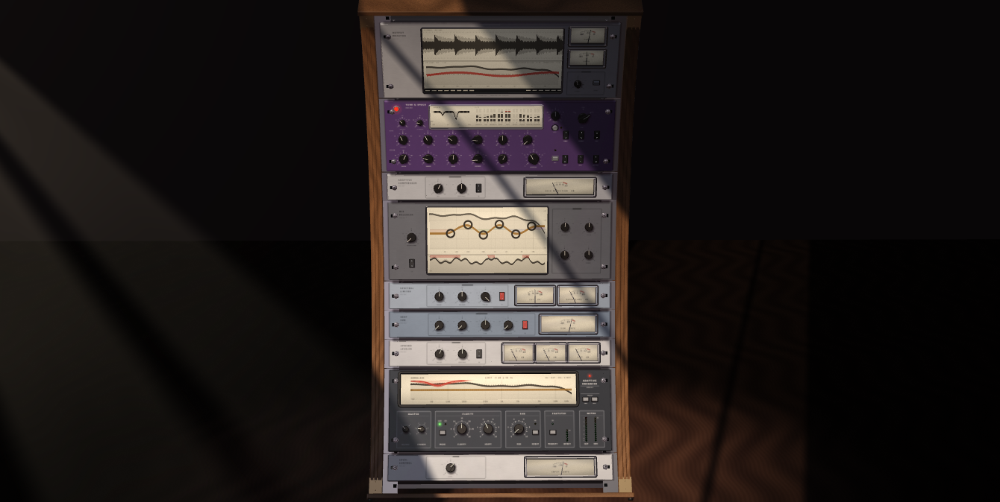
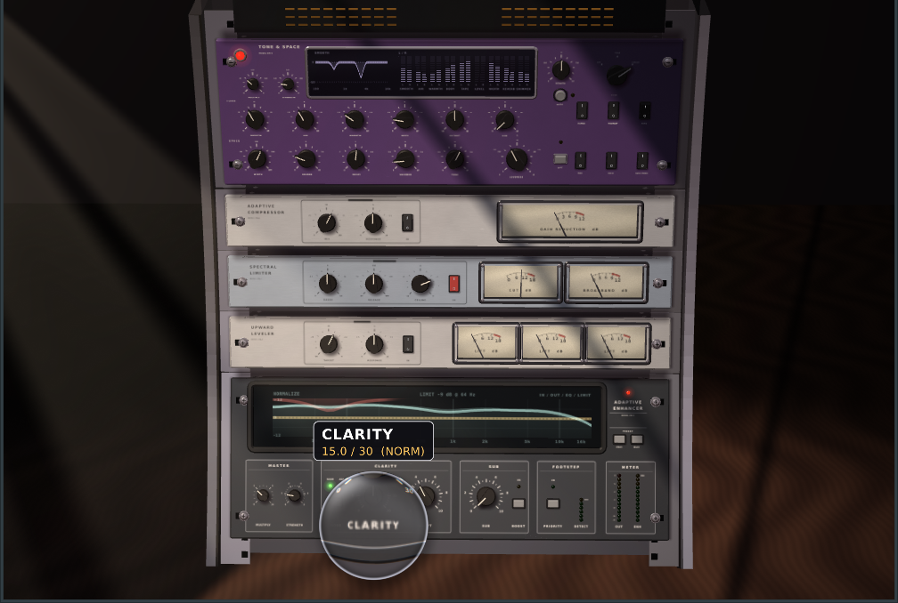
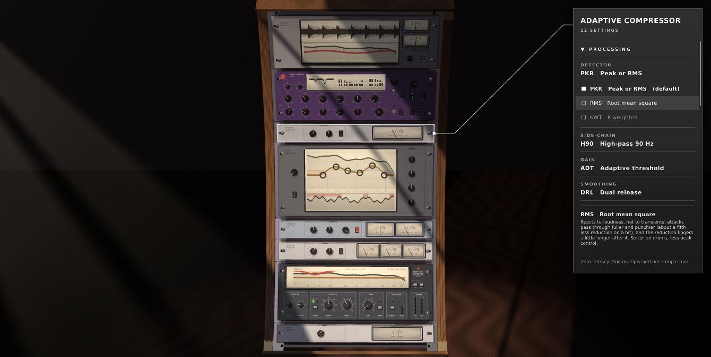

# ENH Master

Adaptive clarity / footstep / sub-bass enhancer for game audio and music production (VST3, Linux and Windows),
with a real-time 3D hardware UI. Built with JUCE; tested in Carla on an Intel J4105.

Eight processors and a monitor in one plugin, in signal order:
- **LEVEL CONTROL**: the rack's working level, with an INPUT meter.
- **ADAPTIVE ENHANCER**: adaptive EQ, generated harmonics, sub and footstep priority.
- **UPWARD LEVELER**: three bands, lifts quiet material.
- **DEEP SUB**: an octave-down sub under the bass line and a resonant steel hull ringing after every hit.
  It makes the low end deep, dark and huge.
- **SPECTRAL LIMITER**: cuts a region that jumps out of balance, or goes over 0 dBFS, where it is, so a
  bass hit doesn't duck the whole mix.
- **MIX BALANCER**: rides six band faders to keep the mix balanced moment to moment.
- **ADAPTIVE COMPRESSOR**: its threshold follows the programme.
- **TONE & SPACE**: tone, space and loudness hold.
- **OUTPUT MONITOR** (on top): how the rack is changing the track. It shows the input against the
  output as a waveform and a spectrum, a red tone-change curve, and BS.1770 loudness.

Unit names describe what each unit does. Until September 2026 they were called ENH MASTER, LUMEN,
TIDE and SERAPH (SILK / HALO / HEAVEN). Parameter IDs keep those old names, so saved sessions and
automation still load; only the names the host and the panels show have changed.





*Nine units in a curved walnut case, bottom to top in signal order: LEVEL CONTROL, ADAPTIVE ENHANCER
(clarity, sub, footsteps and the analyser), UPWARD LEVELER, DEEP SUB, SPECTRAL LIMITER, MIX BALANCER,
ADAPTIVE COMPRESSOR, TONE & SPACE, OUTPUT MONITOR. The case is no taller than it was with eight: the
units sit closer together, and the MIX BALANCER is 3U, down from 4U.*

## Version numbers

From the release after 1.4.1, versions have four parts: **MASSIVE.BIG.SMALL.SMALL**.

| Part | Goes up for | Example |
|---|---|---|
| 1st | massive changes (a rethink of the whole plugin) | **2**.0.0.0 |
| 2nd | big changes (a new system or unit) | 1.**1**.4.1 |
| 3rd | small changes | 1.1.**5**.1 |
| 4th | small changes (fixes, tuning) | 1.1.4.**2** |

In this scheme 1.4.1 reads as 1.0.4.1. 1.1.4.1 raised the 2nd part for a big change (the glass info
panels and the swappable processing methods), and 1.2.4.1 raises it again for another (settings on every
unit, knob modifiers on every knob, and the panel's categories), and 1.3.4.1 once more (the DEEP SUB unit,
a knob dropdown per knob, and a shorter rack).

## Build

The easy way is the builder script. It checks your tools and offers to download JUCE and
[HardwareKit](https://github.com/thenameiscobmarley/HardwareKit) if they're missing. Then it asks two
questions and builds:

```sh
./build.sh
```

- **How many CPU cores:** 1 (slowest, lightest on memory), all of them (fastest), or a number you choose.
- **Replace or copy:**
  - *replace* installs over `~/.vst3/ENH Master.vst3`, the copy your DAW loads.
  - *copy* puts a separate build in `dist/ENH-Master-<version>-<date>/` and leaves the installed
    plugin alone.

You can also skip the questions with flags: `./build.sh --jobs all --mode replace`, or `--jobs 2`,
`--mode copy`, `--tests` (run the DSP tests afterwards), `--clean` (build from scratch), and `-y` (use
the defaults). See `./build.sh --help`. If the compiler runs out of memory with many cores, it offers
to retry with half as many. The build log is `build/builder.log`.

By hand, the same thing:

```sh
git clone https://github.com/juce-framework/JUCE ~/JUCE
git clone https://github.com/thenameiscobmarley/HardwareKit ../HardwareKit   # or pass -DHARDWAREKIT_PATH=

cmake -S . -B build -G Ninja -DCMAKE_BUILD_TYPE=Release   # JUCE_PATH defaults to ~/JUCE
cmake --build build -j"$(nproc)"                          # all cores; add -DENH_COPY_PLUGIN=OFF to not install
build/EnhDspTests_artefacts/Release/EnhDspTests           # offline DSP tests + CPU benchmark
```

Installs `~/.vst3/ENH Master.vst3`. Carla: *Add Plugin → Refresh (VST3) → ENH Master*.

## Windows

**Windows is supported from 1.2.4.1.** Each release has a `windows-x64` zip with the VST3 and the
standalone app.

To get *any* release on Windows, including the older ones that were Linux-only, download
**`convert-to-windows.bat`** from this repository and double-click it:

1. It lists every release on GitHub, newest first, and marks the ones with a ready-made Windows build.
2. Type the number of the one you want.
3. A release with a Windows build is simply downloaded. An older one is built from its own source for
   you: the script fetches that release, JUCE, and HardwareKit as it was then plus today's Windows
   platform files, then builds it with Visual Studio. If Git, CMake or the Visual Studio C++ build tools
   are missing, it offers to install them with `winget`. A build takes 10-30 minutes.
4. The result lands in `ENH-Master-<version>-windows` on your Desktop, and it offers to install the
   plugin into `C:\Program Files\Common Files\VST3` (it asks for administrator rights).

The same script runs unattended with `ENH_TAG`, `ENH_MODE`, `ENH_OUT` and `ENH_YES` (see the top of the
file). The *Windows converter* workflow runs it on GitHub's Windows machines, converting v1.3.0 from
source.

Building by hand on Windows: Visual Studio 2022 (C++), CMake and Git, then

```bat
git clone https://github.com/juce-framework/JUCE ..\JUCE
git clone https://github.com/thenameiscobmarley/HardwareKit ..\HardwareKit
cmake -S . -B build -A x64 -DJUCE_PATH=..\JUCE -DENH_COPY_PLUGIN=OFF
cmake --build build --config Release --parallel
```

## Documentation

`Vault/` is an Obsidian vault (open that folder as a vault) with a tutorial from
install to tuning, plus notes on the DSP and the renderer. Start at `Vault/00 Start Here.md`.

## Reading the panels

The units sit on an arc centred on the viewer, so however many are stacked, every panel faces
the camera head on and nothing is foreshortened.

- **Click a unit** to open its glass panel (see *Glass panels and processing methods*). Clicking
  another unit switches to its panel, clicking the same unit again closes it, and clicking off the
  rack closes it too.
- **Scroll** to walk up to the unit under the pointer, and scroll back to step away.
- With no panel open, clicking the case steps back to the whole rack.
- **Hovering** a knob, switch or button outlines it in white; hovering a unit's faceplate outlines the
  unit.

Hover anything - printed text, a knob, a button - and a **fisheye loupe** appears over it: the scene is re-rendered
zoomed in (1.8x) behind a glass lens about 155 px across, so the magnified print is genuinely sharp rather than stretched pixels.
It magnifies about the cursor - what is under the pointer stays under the pointer - is slightly transparent, and
locks onto a control while you drag it. Controls also show a small name + value pill under the lens, and their
value arc lights up around the knob.

## Glass panels and processing methods



Clicking a unit draws a thin white line from it to a frosted glass panel at the right of the window.
The panel shows the unit's name and its settings, listed one under another in a column that scrolls
with the wheel. The glass is the rack behind it, blurred; there is no tint, only white text, square
corners and a soft shadow.

**Every unit has settings**, in collapsible categories:

- **PROCESSING:** the unit's stages, each with two or three named methods.
- **KNOBS:** every knob is its own dropdown, folded, with a one-line summary under its name ("as it is",
  or what is set). Open one for its own law where it has one, then three modifiers between the knob and
  the processing: **SMOOTHING** (off, 50 ms, 250 ms, 1 s), **CURVE** (linear, low, high, S) and **RANGE**
  (full, 75, 50, 25 %). The host always sees the knob's raw value.
- **OUTPUT** and **DISPLAY** on the OUTPUT MONITOR.
- **RESET TO DEFAULTS** at the bottom puts the whole unit back.

| Unit | Settings (default first) |
|---|---|
| LEVEL CONTROL | GLIDE: 20 ms, 5 ms, 150 ms |
| ADAPTIVE ENHANCER | HARMONICS: Chebyshev 2 + 3, even, odd |
| UPWARD LEVELER | LIFT: standard, gentle, big · GATE: -58, -66, -50 dBFS · BAND BALANCE: voiced, mid focus, flat |
| SPECTRAL LIMITER | NORMAL: 97th, 90th, 99th percentile · CUT WIDTH: region, narrow, wide · LOUDNESS KEEPER: 60 %, 90 %, off |
| MIX BALANCER | REFERENCE: median, average · DEAD ZONE: 1.5, 0.75, 3 dB · LIFTS: half, cuts only, full · ATTACK GUARD: standard, strong, off · LOUDNESS KEEPER: 60 %, 90 %, off |
| ADAPTIVE COMPRESSOR | DETECTOR: PKR, RMS, KWT · SIDE-CHAIN: 90 Hz, 150 Hz, full · GAIN: adaptive, soft, hard · SMOOTHING: dual release, single, opto · MAKE-UP: 65 %, 90 %, none · RESPONSE law: linear, exponential, logarithmic |
| TONE & SPACE | TAPE CURVE: tanh, arctangent, cubic · PRE-DELAY: 18, 8, 35 ms · LOUDNESS WINDOW: 2, 1, 4 s |
| DEEP SUB | SUB SHAPE: sine, warm, growl · TRACKING: standard, fast, stable · HULL MATERIAL: steel, iron, cavern |
| OUTPUT MONITOR | CEILING: 0.0, -0.3, -1.0 dBFS · TONE RANGE: ±12, ±6, ±24 dB · DUCK HOLD: 1.5, 0.5, 4 s · WAVEFORM: peak, RMS |

That makes 29 settings with 85 methods, plus three modifiers on each of 39 knobs.

- Hover any setting and the bottom of the panel explains how it changes the sound and what it costs.
- Settings not at their default are marked with a small white square, and each category counts them.
- Opening, folding, hovering and scrolling all ease rather than jump.
- Only the method in use runs. Audio-rate methods (compressor stages, tape curve, pre-delay,
  harmonics) crossfade over 30 ms when switched; control-rate ones glide through the unit's own
  smoothing. Switching never steps the audio (tested).
- No method changes the latency the plugin reports.
- Choices are saved with the session, are not automatable, and presets leave them alone. Sessions
  from before this release load with every default, which sound exactly as before (checked sample
  for sample).

The full list, generated from `Source/DSP/MethodRegistry.h`, is `Vault/Reference/Methods.md`.
`EnhDspTests --methods` runs every combination through the stability, peak, latency and block-size
checks, and fails if that page is out of date (`EnhDspTests --methods-doc` rewrites it).

**Cost.** The glass is blurred at a quarter of the resolution, only behind the panel and only while
it is open. On the J4105, frame times with the panel open, the blur running and a control outlined
were within the run-to-run noise of the same scenes without them.

## Presets

Nine factory presets set the whole rack at once. They appear in the host's program list, and on the
rack itself: PRESET PREV / NEXT in the ADAPTIVE ENHANCER's maker block. The name shows on the
analyser for a few seconds (and while a PRESET button is hovered). Every preset is a complete
state: anything it does not list goes back to its default.

**The presets live in a local file, not in the plugin**, so they can be edited and re-tuned (by hand
or by an AI) without rebuilding:

| | |
|---|---|
| Linux | `~/.config/ENH Master/presets.json` |
| Windows | `%APPDATA%\ENH Master\presets.json` |
| macOS | `~/Library/ENH Master/presets.json` |
| any | `$ENH_MASTER_PRESETS` overrides the path |

- The plugin writes the factory presets there the first time it runs.
- After that the file is the source. Edits are picked up the next time you press PREV / NEXT or the
  host lists its programs. There's no need to restart.
- The file has a `parameters` block listing every parameter's range, default, units and what its
  0 / 1 or choice numbers mean.
- Values are clamped to their range and unknown names are skipped. A file that doesn't parse is
  ignored, and the last good list stays in use.
- Delete the file to get the factory presets back. They're in `Source/Parameters/FactoryPresets.h`.

`EnhDspTests --presets` tests the same file, so a re-tuned file can be checked as it stands.

| Preset | For |
|---|---|
| DEFAULT | every unit at its default |
| COMPETITIVE FOOTSTEPS | PvP: footstep priority, quiet detail lifted, explosions cut where they are, TONE only (no reverb smearing position), stereo width untouched |
| IMMERSIVE GAMES | single-player / cinematic: sub lift, space and width, hits still controlled |
| NIGHT MODE | quiet listening: small level range, sudden loud events held down hard |
| BASS HEAVY, PROTECTED | big low end (SUB + BOOST) without pumping: deep spectral limiting, bass mono |
| VOICE & STREAMING | speech first: intelligibility, even level, no tail |
| MUSIC: WARM MASTER | tape warmth, a touch of room, leveler OUT so music keeps its dynamics |
| MUSIC: WIDE & AIRY | open top, wide image, a lush modulated hall |
| DEEP SUB: SUBMARINE | the low end deep, dark and huge: an octave-down sub under the bass and a steel hull ringing after every hit |
| TRANSPARENT (ALL OUT) | reference: everything bypassed, MIX BALANCER out too (the enhancer's subsonic filter and the output limiter stay) |

`EnhDspTests --presets` runs every preset through the engine on the synthetic game scene and a bass
hit, IN and OUT of the SPECTRAL LIMITER. Every preset is stable and under full scale, and in every
one the limiter reduces how much the 2 kHz detail ducks under the hit. Numbers from the last run
(dip of the detail, limiter IN / OUT):

| Preset | IN | OUT |
|---|---|---|
| DEFAULT | -0.4 dB | -1.2 dB |
| COMPETITIVE FOOTSTEPS | -0.4 dB | -1.6 dB |
| IMMERSIVE GAMES | -0.1 dB | -0.4 dB |
| NIGHT MODE | -0.5 dB | -1.0 dB |
| BASS HEAVY, PROTECTED | -0.2 dB | -4.0 dB |
| VOICE & STREAMING | -0.4 dB | -0.9 dB |
| MUSIC: WARM MASTER | -0.4 dB | -0.7 dB |
| MUSIC: WIDE & AIRY | -0.0 dB | -0.2 dB |
| DEEP SUB: SUBMARINE | -0.1 dB | -0.4 dB |

With the whole rack running, what is left is the rack's output limiter catching a hot mix. The
spectral limiter alone takes the dip from -1.4 to -0.1 dB.

Two level-matching loops now hold still while the SPECTRAL LIMITER is handling a localised spike:

- **UPWARD LEVELER band gains.** Its complementary crossover lets a big bass hit read as a louder
  mid and top band, so it used to pull the lift on footsteps and detail back on every hit.
- **The enhancer's auto gain.** It used to chase the sub-enhanced spike.

## LEVEL CONTROL (1U, first in the chain)

**LEVEL** (−24 … +12 dB) sets how loud the whole rack runs. It comes first, so every unit after it
hears the level it sets:
- Turn it down and the limiters have less to catch, so they stop ducking.
- Turn it up and they protect harder.
- The UPWARD LEVELER reads levels as if LEVEL were at 0 dB, so it never lifts the rack back up
  against the knob. Tested: the same lift within 0.1 dB at −12 dB.

The **INPUT** meter shows the level going into the rack after the knob (−40 … 0 dBFS RMS).

## OUTPUT MONITOR (3U, on top)

This shows what the rack does to the track. It is printed on the same cream card as the meters, with
the input in pencil and the output in ink.
- **Waveform:** the input and output overlaid, scrolling right to left. Wherever the rack takes a hit
  down, the pencil input shows past the ink output. A faded afterimage of the output stays behind and
  fades over a second or two.
- **SPEED** sets how fast it scrolls: about 20 s across the screen at 1, down to 1 s at 10. It is a
  display setting, not automatable.
- **Spectrum:** the input (pencil fill) and the output (ink). In red, **TONE CHANGE** shows exactly
  how the rack is changing the tone (out minus in, ±12 dB).
- **Loudness** of what leaves the rack, to ITU-R BS.1770 / EBU R128:
  - **MOMENTARY** (400 ms) and **SHORT-TERM** (3 s) LUFS on two dials;
  - **INTEGRATED** (gated, since RESET) and **TRUE PEAK** (4x oversampled) printed under the display;
  - **RESET** starts the integrated reading and the true-peak hold again.
  Checked against EBU Tech 3341: a −23 dBFS stereo 1 kHz sine reads −23.0 LUFS.
- **DUCK** (right, above the tone change) says where a duck is coming from. It names the unit taking
  the most away anywhere in the rack, where in the spectrum, and how much. For example,
  `DUCK  SPECTRAL LIMITER  AT 2.5 kHz  -4.2 dB` or `DUCK  COMPRESSOR  (WHOLE MIX)  -3.1 dB`. The
  deepest duck is held for 1.5 s so a short one can still be read. `LOUDNESS KEPT +1.6 dB` shows the
  loudness keepers' lift (see *Ducking without losing loudness*).

## DEEP SUB (1U)

Low end you feel as much as hear: deep, dark and huge, like standing inside a steel hull under water.
It sits after the UPWARD LEVELER and before the limiters, so they look after what it adds.

- **DEPTH:** the bass line is tracked note by note, and a new tone is generated an octave below it,
  following the bass's own envelope. The tracker uses zero crossings with hysteresis, and its confidence
  only builds on a steady pitch. A note whose octave-down would fall under about 30 Hz, where nothing
  reproduces it, is reinforced at its own pitch instead, blended smoothly.
- **HULL:** six long-ringing low resonances at the inharmonic ratios of a steel shell, struck by the bass
  and the sub. Each drifts very slowly, like a hull under pressure, and a dark rumble breathes under it
  while it rings.
- **SIZE:** from a small boat to a vast hull. The resonances sit between 48 and 22 Hz and ring longer as
  the hull grows.
- **PRESSURE:** weight you can feel on small speakers too: a low shelf on the programme, plus a soft
  saturation of what is generated, which adds the harmonics that make a sub audible.
- **IN:** bypass.
- **Meter:** SUB, what it is adding (dBFS).
- **In the glass panel:** SUB SHAPE (sine, warm, growl), TRACKING (standard, fast, stable) and HULL
  MATERIAL (steel, iron, cavern).

Everything generated is mono, high-passed at 18 Hz, and turned down when the programme is already near
full scale. With DEPTH, HULL and PRESSURE at 0 the audio is not touched at all, so every older preset
sounds exactly as before. The **DEEP SUB: SUBMARINE** preset shows it off.

Tested (`EnhDspTests --units`):
- under an 80 / 98 Hz bass line, DEPTH 8 adds +34 dB at 40 Hz and +27 dB at 49 Hz, an octave below each
  note;
- the hull still rings 0.3–1 s after the bass stops;
- with everything at full on a near-full-scale bass, the output stays bounded and is identical at every
  block size.

## MIX BALANCER (3U)

Rides six band faders the way a mix engineer would. It compares how far each of six regions has
moved from its usual level with how far the mix as a whole has moved (the median of the six), in
these regions: low, 200 Hz, 500 Hz, 1.3 kHz, 3.5 kHz and air. A region that suddenly crowds the mix
is taken down; a region that drops out is lifted, gently.

- **It corrects balance, not loudness.** When everything gets louder together, nothing moves.
  Tested: −0.2 dB at most for a +10 dB jump.
- **Attacks go through.** A band in a fresh transient isn't cut yet, so footsteps and gunshots keep
  their front edge.
- **It ignores what isn't there.** Bands carrying almost nothing of the mix are left alone.
- **Zero latency.**
- **Controls:** BALANCE (how much of each jump it corrects), SPEED, TILT (steer darker or brighter),
  RANGE (the most any band moves; lifts are held to half of it) and IN.
- **RESOLUTION** blends from **6 BANDS** (0) to **SPECTRAL** (10): 28 third-octave bands from
  31.5 Hz to 16 kHz, each ridden the same way against the median of all 28. It's as precise as
  balancing gets without an FFT's latency.
  - Tested: a 2.5 kHz whistle is cut −4.1 dB in its own band, with no change an octave away.
  - In between, the six faders are scaled by 1 − RESOLUTION and the 28 by RESOLUTION, in series, so
    the result is exactly the blend of the two curves, with no phasing.
  - Spectral mode costs 1.7 % of a core extra, and nothing at 0.
- **Loudness keeper:** while bands are cut, the rest of the mix is lifted to hold the loudness (see
  *Ducking without losing loudness*).

Its four main knobs sit in a 2 x 2 grid beside the display (it was 4U, with a column of four).

The display is laid out FabFilter-style, printed on the cream card like every display on the rack:
- the spectrum going in (filled) and coming out (line);
- the six faders drawn as the curve they make, with a handle on each band;
- the last ten seconds scrolling underneath, Pro-C style: level in, level out, and the cut hanging
  from the top in red.

## Limiting: only real overs, always where they are

There are two reasons anything on the rack ducks, and both use the same spectral cut, confined to the
region responsible:
- **Tone.** The SPECTRAL LIMITER cuts a region that jumps out of balance with the rest of the
  spectrum. A louder mix overall isn't a reason.
- **Clipping.** Only when something would go over **0 dBFS**. The SPECTRAL LIMITER's CEILING is now
  0 dBFS in every preset.

The output limiter at the very end is spectral too:
- It looks 1.5 ms ahead. When a peak would go over, it works out exactly how much of the region
  pushing hardest in that direction to take out. It uses the same filters it cuts with, so the answer
  is exact.
- A broadband stage then catches only what's left.
- Nothing under 0 dBFS is touched (tested: bit-exact at −1 dBFS).
- A clipping bass hit takes its own low end down while a 2 kHz tone above it moves 0.1 dB.
- **True peak:** nothing leaves above 0 dBTP either. The broadband stage estimates the peaks between
  samples (4x, the loudness meter's interpolator), so players and lossy encoders don't clip on them.
  Before 1.3.4.1 the output could reach +0.8 dBTP.
- Latency: 3.2 ms (153 samples at 48 kHz), reported to the host.

### Ducking without losing loudness

Taking away the excess of a region that jumped out loses nothing: that excess was never part of the
mix. But a cut often takes a region *below* what it usually carries. A wide cut spills onto its
neighbours, and a cut is still letting go after the event has passed. Then the mix is quieter than
usual, and everything else *sounds* quieter too, even though its level never moved. That is what
makes a heavy duck easy to hear.

The SPECTRAL LIMITER and the MIX BALANCER each have a **loudness keeper** for this:
- They measure how far the cuts take each band below its usual level, ear-weighted (the shape of the
  K-weighting that LUFS uses, so a bass cut counts for less than a presence cut).
- They give 60 % of that loss back to the whole mix, following the cuts in and out.
- The lift is capped at 3 dB and never goes past the headroom left under 0 dBFS.
- A cut made for clipping is not made up, because there is no room to give back.
- The compressor's key doesn't hear the lift, so the keeper can't make the compressor duck in turn.

Tested (`EnhDspTests --units`): a 500 Hz burst cut by 5.8 dB gets no make-up while it lasts. As the
cut lets go afterwards, a tone three octaves up is lifted 0.3 dB. With nothing cut, the keeper does
nothing. In the bass-hit scene below, the 2 kHz detail now moves −0.1 dB (it was −0.3).

A bug fix makes a big difference here. The UPWARD LEVELER was meant to hold its lift while the
SPECTRAL LIMITER handles a localised hit, but the hold was never switched on. With it working, the
detail dip under a bass hit is much smaller:

| Preset | Before | Now |
|---|---|---|
| DEFAULT | −1.2 dB | −0.5 dB |
| COMPETITIVE FOOTSTEPS | −1.9 dB | −0.6 dB |
| BASS HEAVY | −4.3 dB | −0.4 dB |

## SPECTRAL LIMITER - anti-pumping dynamic EQ (1U)

Sits between the leveler and the compressor. The compressor's detector is broadband, so a sudden
bass hit used to pull everything down with it, footsteps and detail included. This unit handles the
hit where it is, in this order:

1. **Tone - a region jumps out of balance:** up to three moving cuts follow the offending region. Each
   is a bell, or a shelf when the excess runs off the bottom or top of the spectrum. Nothing else
   moves. How loud the programme is doesn't enter into it.
2. **Clipping - the stage would go over CEILING (0 dBFS):** the same region is cut deeper, by as much
   as that region's share of the energy says is needed.
3. **Broadband:** gain reduction only when the abnormal energy covers most of the spectrum *and* the
   stage would clip.

The compressor is keyed through the same cuts, made deeper: while a localised event is being handled
here, the compressor does not duck the whole mix for it as well. That's an adaptive version of the
side-chain high-pass on a bus compressor. With nothing flagged, the key is the audio itself.

Detection reuses the ADAPTIVE ENHANCER's 24-band analyser, adding no second analyser. Per band it adds:

- a rolling baseline that barely moves while the band is flagged;
- what is *normal* for that band: the 97th percentile of its excursions over the last 10 s, not
  counting the newest 1.5 s;
- leakage rejection, so a 70 Hz hit does not also count as 400 Hz.

A kick drum teaches it that its hits are normal, so normal bass is left alone. Nothing is hard-coded
to a frequency: a 5 kHz whistle is cut at 5 kHz.

| Control | What it does |
|---|---|
| RANGE | deepest spectral cut, 0-18 dB |
| RELEASE | how fast a cut lets go, 30-600 ms (attack follows it, 1.5-8 ms) |
| CEILING | headroom protection threshold at this stage, -12..0 dBFS |
| IN | hardware bypass |

The meters read the deepest spectral cut (0-18 dB) and the broadband protection (0-12 dB). The
analyser on the ADAPTIVE ENHANCER shows where it is cutting: a magenta curtain hanging from the top of
the plot at the real frequency and depth (amber for broadband), and a `LIMIT -9 dB @ 68 Hz` readout.

Measured (`EnhDspTests --limiter`), with a huge bass hit over a mix with kicks and a 2 kHz detail band:

| | 2 kHz detail during the hit | compressor gain reduction |
|---|---|---|
| limiter OUT | -1.4 dB | 15.2 dB |
| limiter IN | -0.1 dB | 9.2 dB |

- The hit gets a 6 dB cut around 85 Hz; the kicks get 0.00 dB.
- The cut releases within 0.7 s.
- A broadband event gets no spectral cut (0.1 dB), only broadband protection (6.2 dB).
- The result is identical at block sizes 7, 128 and 1024.
- Cost: about 1.1 % of one J4105 core at 48 kHz.

## ADAPTIVE COMPRESSOR (1U)

Two controls, no threshold knob. The threshold, ratio, knee and ballistics all follow the
programme: loudness now and over the last seconds, crest factor, spectral tilt, transient density
and a running estimate of the loud part of the material. Peaky material gets a higher threshold and
a gentler ratio so transients survive; dense material is held down.

| Control | What it does |
|---|---|
| MIX | wet / dry, after auto make-up, so the blend does not change the level |
| RESPONSE | how fast it reacts and how deep into the programme the threshold sits |
| IN | hardware bypass |

The VU reads gain reduction, 0-12 dB.

## UPWARD LEVELER - three-band (1U)

Lifts quiet material toward a target, per band, because "quiet" is rarely true of a whole signal at
once. LR4 splits (which sum back to the input exactly), a per-band estimate of what is loud here
and now, a noise floor that settles on the quiet moments, and gates on absolute level and
modulation so hiss and room tone are never lifted.

| Control | What it does |
|---|---|
| TARGET | the level quiet material is brought toward (-36 to -6 dBFS) |
| RESPONSE | how quickly it follows, and how hard the slew limits bite |
| IN | hardware bypass |

Three VUs read the lift in the low, mid and high bands, 0-18 dB.

## Device masters

Each unit has two small master knobs:

| Control | Parameter | What it does |
|---|---|---|
| MULTIPLY | `enhMultiply` / `seraphMultiply` (TONE & SPACE) | 0-3x. Multiplies every knob on that device before the DSP sees it (1.5x makes CLARITY 20 behave as 30). TONE & SPACE's OUTPUT gain is not multiplied; ENH Master has no gain knob. Values may pass a knob's printed end and are clamped to what the processing can take. |
| STRENGTH | `enhStrength` / `seraphStrength` | 0-5. How hard that device's processing hits: EQ moves, generated harmonics, sub lift, resonance dips, air, body, width, tail level and shimmer. 0 = the device does nothing; time settings (DECAY, TONE, ADAPT) are not scaled. |

## TONE & SPACE (last processor, under the OUTPUT MONITOR)

A purple finishing processor, the last in the chain, processing everything below it. **LOUDNESS** is
its level policy: one knob with two printed scales and a button to swap them. In HOLD it measures
what came in and what is going out and works the output back toward the input, so the effect is
loud enough to hear and never louder than the music. In LIFT + HOLD it adds gain first and then
holds *that* steady, for sources that are quiet to begin with. **POWER**: OFF (true bypass) /
TONE (tone & texture only) / +SPACE (TONE + SPACE). Zero latency.

**AUTO + HEAVEN** (right of the display): press AUTO and the unit tunes its own heaven. It listens to the
programme over a few seconds (sustained or percussive, mono or wide, dull or bright, thin or full in the
low end) and moves REVERB, DECAY, SHIMMER, SPACE TONE, WIDTH, AIR and SUB toward what that programme
wants: long, shimmering and wide for pads and ambient music, shorter and drier for busy percussive material,
more air on dull sources, more SUB on thin ones. **HEAVEN** sets how far it goes, from 0 (your knobs) to
10 (all AUTO). The move is smoothed over seconds, so the space never jumps. You can watch it work: the
knobs turn themselves to what AUTO is applying, and turn back to your settings when AUTO is off. Your
saved settings never change, and a knob you are holding shows your own value. **MATCH** does the same
with OUTPUT: the knob shows the level-match gain it is adding.

One unified front (no channel split): a live display in the middle, the ten knobs in one row along the bottom,
the six I / O rocker switches (I = on) in a grid on the right, lamp and POWER on the left. The display shows, live:

- **left**: SMOOTH's resonance dips across 150 Hz – 16 kHz, right now;
- **right**: a pair of L / R bars per process - SMOOTH, AIR, WARMTH, BODY, TAPE, LEVEL (auto gain, centre = 0 dB),
  WIDTH, SPACE, SHIMMER - each showing how much that process is changing that channel (energy of the change
  relative to the channel's own input, −42 … −6 dB).

`PAD_UI_TEST_DEMO=1` animates the display without audio (dev only).

**TONE - tone & texture**

| Control | Parameter | What it does |
|---|---|---|
| SMOOTH | `silkSmooth` | 28 detection bands (150 Hz–16 kHz). A band that suddenly sticks out of its own spectral neighbourhood gets a narrow dynamic dip, only while it sticks out. A smooth spectrum is left alone. |
| AIR | `silkAir` | high shelf + generated 10–20 kHz harmonics; more on dull sources, less while SMOOTH is busy |
| WARMTH | `silkWarmth` | envelope-normalised low-mid harmonics + gentle triode curve |
| BODY | `silkBody` | low-mid fullness at 180 Hz, only as much as the source is thin |
| OUTPUT | `silkOutput` | trim, ±12 dB |
| PROTECT | `silkProtect` | lifts a dip the moment an attack arrives and halves dips in 1–4.5 kHz (footsteps keep their bite) |
| TAPE | `silkTape` | pre-emphasised soft saturation that rounds harsh transients |
| SUB | `silkSub` | heaven for the low end: a clean 80 Hz shelf, a warm envelope-normalised 2nd harmonic (so the bass is felt on small speakers too) and a soft mono bloom that swells in the gaps after bass notes. All three back off as the bass gets loud, so a big low end is never pushed into the limiter. |
| MATCH | `silkAuto` | loudness-matched output (the rocker was labelled AUTO before 1.2.0) |

**LOUDNESS** is TONE & SPACE's level policy: one knob with two printed scales and a button to swap them.
In HOLD it measures what came in and what is going out and works the output back toward the
input, so the effect is loud enough to hear and never louder than the music. In LIFT + HOLD it
adds gain first and then holds *that* steady, for sources that are quiet to begin with.

LOUDNESS measures K-weighted power (bass counts less, as it does for the ear) over ~2 s and moves its gain
over ~3 s, so a bass note no longer pulls the whole mix down and lets it back up when it stops (pumping).
The rack ends in the output limiter (see *Limiting*): 0 dBFS, the region responsible cut first, gain
held for 25 ms so it never moves inside a bass cycle, and loud bass is not crushed. SPACE also has early reflections (sparse stereo
taps, 7-37 ms) ahead of the dense tail.

**SPACE - space & width**

| Control | Parameter | What it does |
|---|---|---|
| WIDTH | `haloWidth` | 0–200 %; near-mono sources get decorrelated width added to the side only, so the mono sum never changes |
| SPACE | `haloSpace` | amount of an 8-line FDN reverb (Hadamard mixing, per-line damping, 4 diffusers, 18 ms pre-delay), fed from the mid above 200 Hz |
| DECAY | `haloDecay` | 0.3–8 s |
| SHIMMER | `haloShimmer` | pitch-shifted copies fed back into the tail: an octave up and, quieter, an octave and a fifth up |
| TONE | `haloTone` | dark plate … airy hall |
| DUCK | `haloDuck` | tail ~10 dB lower while the music is busy, blooms in the gaps |
| BASS MONO | `haloBassMono` | Linkwitz-Riley split, side removed below 120 Hz |
| MOD | `haloMod` | slow delay modulation for a lusher tail, and a slow drift of the tail around the stereo field (~20 s a cycle) |

## Controls

| Control | Parameter | What it does |
|---|---|---|
| MODE | `clarityMode` | Lever down = **NORM** (normalise only), lever up = **ADD + NORM** (normalise and add enhancement) |
| CLARITY (NORM) | `clarityNorm` | 0–30: strength of the source-dependent correction + loudness match; adds nothing (no harmonics, no lift) |
| CLARITY (ADD) | `clarityAdd` | 0–10: correction **plus** adaptive DEPTH/CLARITY harmonics and a detail lift where the planner finds definition/body missing |
| ADAPT | `adaptSpeed` | How fast every adaptive gain, the long-term spectrum and the harmonic centres follow the material |
| SUB | `sub` | Dynamic sub lift + psychoacoustic bass harmonics (tuned to the playing bass note) |
| +BOOST | `subBoost` | Higher sub ceiling, 55 Hz punch, more harmonics |
| FOOTSTEP | `footstep` | Footstep classification → lifts the bands the step actually rose in, ducks nearby maskers |

CLARITY is one knob with two scales: pressing MODE swaps the printed scale (white 0–30 for NORM, amber 0–10 for
ADD + NORM) and the knob turns to that mode's own stored setting. NORM 30 and ADD 10 normalise equally hard.

Front panel (Pro-XL style): charcoal faceplate with outlined CLARITY / SUB / FOOTSTEP / METER sections,
small black knobs over fixed printed scales, latching push buttons with an LED above (MODE has NORM + ADD LEDs),
and LED ladders: DETECT (footstep confidence), OUT (output peak, -30…0 dB), ENH (live enhancement activity).
Knobs: drag vertically (Shift/Ctrl = fine), wheel to nudge, double-click to reset. The pointer line tints by who
moved it while moving: gold user, cyan host automation, violet self-tune.

The display shows the applied adaptive EQ response (24 bands, 40 Hz – 16 kHz) and flashes on detected footsteps.
The lid vents glow with enhancement activity (pink) and detected footsteps (lime).

## Footstep detection adapts to the game

The classifier still rejects crates, gunshots, voices and rattles. Two things now adapt to the
programme:

- **How fast steps die away** is learnt from the steps it accepts. In a reverberant game, or on wood
  and carpet, steps decay more slowly, and the decay test scales with them (never below about half
  the default). The 110 ms sustain check scales the same way.
- **A second look at 70 ms** is given to an event that failed only on decay: over a longer window,
  with no lift while it waits.

Both apply only to real impacts:
- the event peaks within 12 ms of its onset (a syllable swells over tens of ms);
- it stands at least 14 dB above its own background;
- it is outside tonal activity.

Under a voice, the default rules stand.

Reverberant rooms (RT about 0.6 s, `EnhDspTests`):

| | Seed 5 | Seed 88 |
|---|---|---|
| Fixed rules | 60 % | 50 % |
| Adaptive | 73 % | 67 % |

Voice false time in those rooms is unchanged, and every other detection test holds.

## ADAPTIVE COMPRESSOR: dual release

A slow follower carries the average gain reduction; a fast one takes only what a transient needs,
and gives it back in about 50 ms. In the test, a steady tone under a kick every 0.5 s sits 0.69 dB
off its level on average, against 1.02 dB with the old single release: 32 % less pumping at the
same average gain reduction.

## Listening with EnhAudioLab

`EnhAudioLab` (built with the other tools) runs audio through the real engine with any preset, knob or
processing method, and writes what it did as audio, text and pictures. That is how the rack's sound is
checked beyond the pass/fail tests.

```sh
build/EnhAudioLab_artefacts/Release/EnhAudioLab scenes                        # the built-in test signals
build/EnhAudioLab_artefacts/Release/EnhAudioLab render --scene game --preset "COMPETITIVE FOOTSTEPS" --out lab/game
build/EnhAudioLab_artefacts/Release/EnhAudioLab render --in capture.wav --set deepDepth=7 --set tideDetector=1 --out lab/mine
build/EnhAudioLab_artefacts/Release/EnhAudioLab contrib --scene music --preset "DEEP SUB: SUBMARINE" --out lab/who
build/EnhAudioLab_artefacts/Release/EnhAudioLab ducks --scene steps --seconds 30 --preset "COMPETITIVE FOOTSTEPS" --out lab/ducks
build/EnhAudioLab_artefacts/Release/EnhAudioLab trace --scene bassduck --preset DEFAULT --out lab/trace
build/EnhAudioLab_artefacts/Release/EnhAudioLab compare a.wav b.wav --out lab/ab
build/EnhAudioLab_artefacts/Release/EnhAudioLab suite --out lab/suite          # every scene through a set of presets
```

- **Scenes:** game, steps, music, drums and bass, a bass line, an explosion, quiet, voice, a sweep,
  tones (THD and IMD), impulses and pink noise, plus two that hold everything still but one thing:
  **bassduck** (the same quiet detail and footsteps from start to finish, loud bass only from 3 to 5 s)
  and **gaps** (music, silence, music). Any WAV file can be used instead.
- **Every render writes:**
  - `in.wav` and `out.wav` (latency removed);
  - `report.txt`: levels, BS.1770 loudness, true peak, loudness range, crest, stereo, third-octave
    bands in and out, the low end in detail, the gain per band over time (pumping), new clicks, and
    THD / IMD on the tones;
  - `spectrogram.png`, `spectrum.png`, `waveform.png` (with momentary loudness and the gain per band
    over time) and `lowend.png` (10–250 Hz at high resolution).
- **`contrib`** is what each unit adds or takes away, per band.
- **`ducks`** is who ducks what, when: each unit's effect on low / mid / high over time.
- **`trace`** is every unit's own gain, read out of the engine as it runs (every 10 ms): the leveler's
  lift per band and what it is reading, the balancer's six faders, compressor gain reduction, the
  spectral limiter's cuts, MATCH, the output limiter, the enhancer's auto gain. `trace.txt` also prints,
  for each of them, how far it moved and when it moved most. This shows which unit reacted first, which
  a measurement of the output alone cannot.
- **`--set`** takes any parameter: knobs in their own units, switches 0 / 1, methods by index.

### What listening found and fixed (1.3.4.1)

- **Clicks from TONE & SPACE.** PROTECT dropped a resonance dip out of the signal in one sample, which
  stepped the waveform. It now fades the dip out over 1 ms. AIR's and BODY's filters clicked whenever
  their gain moved (a direct-form biquad changed under its own state). They are now state-variable
  filters, which can change without a click. Tested on sweeps, bass lines and impulses: 0 clicks.
- **A crack on every hit from the enhancer's ADD harmonics.** At an attack the exciter's normalised
  partial could run to 5x its range, and the generated harmonics burst out at up to +66 % of the
  signal. It is now held to its working range, so steady harmonics are unchanged and attacks are clean.
- **True peak over 0 dBFS**, up to +0.8 dBTP, is now held at 0.0 dBTP (see *Limiting*).
- **The MIX BALANCER took footsteps back.** The enhancer lifted each step and the balancer took
  1.5–4.5 dB of it off again. It had learnt a standing cut where the steps live. While footsteps are
  being lifted, its cuts now let go: its effect on the footsteps went from -3.7 dB to -0.1 dB.
- **TONE & SPACE's MATCH pulled the whole mix down after big hits.** It measured over 0.4 s, so the
  harmonics TONE adds to a huge bass hit read as extra loudness, and it turned everything down by up
  to 4.5 dB for seconds. It now measures and follows over 3 s and holds through bursts: -2.1 dB at
  worst.

### Why the mix ducked under bass (1.3.4.1)

Four separate causes, found with `trace` on the **bassduck** and **gaps** scenes, where everything but the
bass (or everything but the silence) is held still, so anything that moves is the rack reacting.

- **The leveler's crossover was not a crossover.** LUMEN split low / mid / high by lowpassing and then
  *subtracting* the result from the signal. The filter shifts the phase, so the subtraction did not take
  the bass out: a 50 Hz note came out of the midrange band 1 dB down, and the leveler read every bass note
  as a loud midrange. Its lift on detail and footsteps fell from +8.7 dB to nothing and took many seconds
  to come back — the mix ducked under bass, and on steady material the lift wandered down to zero. It is
  now a real Linkwitz-Riley 4th-order split, both halves taken from the filter, with the low band passed
  through the second split's allpass so the three still sum flat (level error 0.07 dB). A 50 Hz note now
  reads 48 dB down in the midrange band, and the lift holds right through the bass.
- **The lift limits were recalibrated** (9 / 18 / 14 dB to 6 / 12 / 9) because a real split lifts far
  harder than a leaking one, and a band that has loud moments of its own is now lifted less than a band
  that is simply quiet — otherwise an ambience with explosions on top of it is flattened.
- **The compressor learnt the silence.** Its "how loud is this programme" tracker walked all the way
  down through a pause, so the first seconds of music after a gap were clamped by up to 20 dB. It now
  holds that estimate while the material is 20 dB or more below it: 3 dB on re-entry instead of 20.
- **MATCH and the enhancer's auto gain kept integrating through silence** and came back from a gap
  several decibels down. Both now hold while there is nothing playing. MATCH also follows over 10 s
  instead of 3 and is limited to ±6 dB: it is a trim that stops the unit changing the level, not a
  leveller of its own. The mix's own ducking after a bass passage fell from 2.7 dB to about 1 dB.

## Signal chain (Source/DSP)

```
input ─► analysis: BandAnalyzer (24 log bands + long-term spectrum), SpectralAnalyzer (FFT tonality),
  │                FootstepDetector (event classifier), HarmonicPlanner, sub follower
  └─► AdaptiveEQ (source-derived curve + footstep lift, solved 24-band peaking cascade)
      ─► SubEnhancer ─► AnalogStage
         (subsonic HP, loudness-matched auto gain,
          2x oversampled adaptive DEPTH/CLARITY exciters + transformer colour + soft ceiling)
```

- **No preset curve.** There is no built-in "smile": on pink noise the EQ stays within ±0.1 dB. The curve comes from the
  programme's long-term spectrum: resonances are cut and holes filled where they are, and treble (2.5–10 kHz) and bass
  (40–160 Hz) are rebalanced only when clearly out of range relative to the midrange. The curve is anchored on the
  midrange; cuts in 250 Hz – 5 kHz are limited to −1.5…−3 dB and never land on the current footstep's bands.
- **Accurate response.** The 24 overlapping peaking filters are solved (regularised least squares), so the applied response
  matches the displayed curve (≤ 0.03 dB in tests).
- **Adaptive harmonics.** HarmonicPlanner scores every band for "real content here, but its 2nd/3rd harmonic region is
  comparatively empty" and centres the DEPTH (sources 70–500 Hz) and CLARITY (600 Hz–5 kHz) exciters there. Each exciter
  isolates its band with a moving SVF, normalises it by its own envelope and uses Chebyshev polynomials (T2/T3), so real
  2nd/3rd harmonics are generated at the same relative strength for quiet and loud sounds.
- **Footstep classifier.** Every onset is an event judged on behaviour, not just frequency: it must decay quickly, be
  noise-like (no persistent spectral peaks in its new energy — latches, hinges, creaks, chimes and voices have them),
  not be one of a burst of similar onsets < 200 ms apart (rattles, rummaging), not follow a rejected ringing/rattling
  event within ~1 s, not be hot/broadband (gunfire). Steps that continue the walking rhythm and match the learned
  spectral fingerprint get the full lift; a lone event a moderate one. Timeline: +4 ms slight provisional lift,
  +42 ms decision, until +160 ms a watch that retracts ringing/sustained events. The 1–4 kHz region is a gentle
  preference for where to lift, not a requirement for detection.
- **PD control:** every adaptive gain follows its target with value' = (Kp·e + Kd·target') / (1 + Kd).
- **Latency:** IIR only; the reported latency is the oversampling filters' (a couple of samples).
- **CPU (J4105, 48 kHz stereo):** about 19 % of one core for the whole rack (seven processors and
  the loudness meter; `EnhDspTests --cpu`). The five-unit rack
  used 30 %, and the same five units now use 16.6 %, with output identical to the last bit (a golden
  output check proves it). The savings come from the band analyser, TONE & SPACE's 28-band detector
  and the enhancer's EQ running four bands (or both channels) per instruction.

## Test results (`EnhDspTests`, synthetic scenes)

- Crate openings (latch ring, lid creak, rummage rattles, lid thud) between walking: v4 flags 3 of 8 crates, only as
  brief blips (none lifted > 150 ms), lift active 3–4 % of crate time — v3 flagged 8/8 and lifted
  54–61 % of crate time. Steps around crates: 96–100 % (v3: 96–100 %).
- Footsteps over ambience with gunshots and voice: 83–92 % classic, 76–86 % mixed surfaces (v3: 86–100 %; misses are
  steps under loud speech); ≤ 1 gunshot flagged; ≤ 6.5 % of voice time flagged. Quiet scene 23/23.
- AutoEQ: pink ±0.1 dB; muffled source +2 dB treble vs bass; thin source the opposite; 600 Hz resonance −2.1 dB;
  1.5 kHz hole +1.8 dB; 1–4 kHz never scooped.
- Harmonics: centres track 220 Hz / 1 kHz / 2.5 kHz sources; 2nd harmonic −15…−21 dB rel. fundamental at full CLARITY
  (−50 dB off), identical at −18 and −42 dBFS input.
- Neutral settings ±0.04 dB; auto gain within ~1.5 dB; SUB +5.6 dB at 50 Hz, +10.3 dB with BOOST; stable at
  44.1/48/96 kHz and block sizes 1–1024; output peak ≤ 0.99.

These are synthetic sounds — real game mixes will differ. To check a real capture:

```sh
build/EnhDspTests_artefacts/Release/EnhDspTests --analyze capture.wav [clarity 0..1]
```

prints every accepted / rejected event with its reasons, the EQ curve and the harmonic centres every 5 s.
`--events quiet|game|varied|crates [seed]` does the same for the synthetic scenes with ground truth.

## Model library

The 3D side lives in a shared JUCE module, **HardwareKit** (`~/Projects/HardwareKit`), so other plugins can reuse it:
geometry primitives, hardware models (knob styles, push buttons, bat toggles, jewel lamps, LEDs, rack screws,
chassis), materials, control animation, X11 pointer / visibility helpers and the fisheye loupe. ENH Master keeps only
what is specific to it: its layout, its printed panels and its display shaders. See `HardwareKit/README.md`.

Knob styles in use: every knob is `chickenHeadKnob` (black bakelite, beak ending at the ticks); POWER is a
`chickenHead` selector (the long-beak version).

## Anti-aliasing

- **Main view:** 4x MSAA by default. `msaaSamples` in `~/.config/ENHMaster/ui-config.json` takes
  0 / 2 / 4 / 8. On an Intel UHD 600, 8x costs noticeably more late frames, so 4x stays the default.
- **Loupe:** now rendered multisampled too (it used to be aliased).
- **Procedural textures** (HardwareKit): brushed and powder-coat noise, lacquer flake and knob grip
  ridges are band-limited by pixel footprint. Where a pixel covers many cells they fade to their
  average instead of crawling or forming moire as the camera moves.

## The rack

A curved case in oiled walnut:
- solid cheeks with a chamfered inner edge, two routed grooves down the front, a rounded outer front
  edge, and end grain showing top and bottom;
- a crown board on top and a plinth underneath on four turned feet;
- a dark-stained back board seen through the gaps;
- brass corner protectors with their screws;
- the steel mounting rails with square holes.

The grain follows the arc on the cheeks and runs across on the crown and plinth. Every stripe fades
to its average once it is finer than a pixel, so it never shimmers.

All the displays are printed on the same cream card as the meter faces: pencil for what comes in,
ink for what goes out, sepia for EQ curves, and red for cuts and tone change.

The front mounting rails are straight segments, one per unit, as in a real curved cabinet. Each
lies flat against the back of its unit's faceplate, meeting its neighbours in the middle of each gap.
They are zinc-plated, with square rack holes under every ear screw. The units sit 0.03 inside the
cheeks' arc, and a contact shadow runs where the ears clamp to the rails.

## Hardware styles

HardwareKit now has 50 knob styles, 5 switch styles and 5 button styles. Most knob styles are
recipes (skirt, body shape, grip carving, cap, pointer, materials) built by one generator at every
level of detail:

- console knobs with coloured caps;
- vintage: Marconi, bakelite, cream radio, chrome-skirt cones, wing pointers;
- machined metal: silver, black, gunmetal, brass, crosshatch, stepped, chrome dome;
- instrument collets and Eurorack knobs;
- rubber knobs and pointer bars;
- hi-fi discs;
- guitar top-hats and speed knobs.

Switches: I / O rocker (standard, red, wide), bat toggle, paddle toggle. Buttons: square, round,
wide, chrome bezel, soft dome. `PAD_UI_TEST_GALLERY=1` lays every style out on the enhancer (dev only).

Every knob on the rack is a black bakelite chicken head: a round back end that tapers to a
pointed beak, with a painted white line along it. The knobs' beaks stop at their printed ticks, and the
POWER selector's reaches out over its positions. Plastics are satin and the pointer lines are paint, not
glowing. The panels follow the same idea: a model number instead of feature lists, plain black meter
bezels, single-colour displays, and no animated signal-flow arrows.

In use:

| Unit | Knobs | Switches and buttons |
|---|---|---|
| every unit | black chicken heads (POWER: the long-beak selector version) | |
| ADAPTIVE ENHANCER | | square buttons |
| TONE & SPACE | | chrome-bezel LIFT button, round AUTO button with its own LED |
| SPECTRAL LIMITER | | red I / O rocker |

The rockers are 30 % larger than in 1.1.

## Detail and resolution

- **Detail levels:** every knob, selector, push button and switch is built at four levels (32, 64,
  128 and 256 segments round). Each frame, each control is drawn at the level its size on screen
  calls for, including inside the zoomed loupe. So walking up to the rack, or scrolling to zoom,
  brings in finer geometry.
- **Carved detail** (levels 2 and 3) is real geometry, not painted on:
  - knurled and ribbed grips and flutes;
  - brushed inserts and trim rings;
  - set screws;
  - anodised cap inserts in muted unit colours: petrol (compressor), bronze (leveler), oxblood
    (limiter).
- **Switches:** I / O rocker switches, with the I end pressed in when on (see Hardware styles).
- **Screws:** pan-head ear screws on washers.
- **Printed panels:** 4096 px wide, mipmapped, so the GPU uses the resolution the camera needs and
  the print sharpens as you get closer. Scale rings are 1024 px, meter faces up to 1536 px.
- **Speed:** `maxDetail` (0 to 3) in `ui-config.json` caps the finest level on slow GPUs. On a J4105,
  walked up to TONE & SPACE runs at about 38 ms a frame at level 3 and 35 ms at level 1.

## Layout: how units are placed, and LayoutViz

Everything in the scene is in world units, not pixels, and nothing in it depends on the window:

- **Units:** placed on a vertical arc from constants in `Source/UI/Scene/DeviceLayout.h`
  (`unitArcPos` / `unitAngle` / `unitOrigin` / `panelToWorld`).
- **Controls:** panel-local constants (x across, z down the faceplate). Some are calculated as first
  position + step x index. Knob sizes are a fixed base radius times a fixed size multiplier.
- **The window:** only reaches the camera (`CameraRig::build`), which moves back until the whole
  case fits. So on screen everything scales together with the editor size.

`LayoutViz` (built with the plugin, `ENH_BUILD_TOOLS`) uses that same code to draw the layout for any
editor size. It writes an SVG with the window boundary, a pixel grid and rulers, every unit's
projected faceplate, centre and size, and every control's footprint (hover for its panel values). It
also prints the underlying values, each marked FIXED, MULTIPLIER or CALCULATED:

```sh
WIDTH=1200 HEIGHT=700 OUT=layout.svg build/LayoutViz_artefacts/Release/LayoutViz
FOCUS=4 WIDTH=1340 HEIGHT=720 OUT=limiter.svg build/LayoutViz_artefacts/Release/LayoutViz   # walked up to unit 4
```

It is analysis only; it does not change the plugin.

## UI performance

Knobs light a value arc while hovered or moving, LEDs and lamps cast soft halos, and clicks are ignored unless the
plugin window is really the topmost window under the pointer (so clicking in an app that covers it cannot move knobs).

Rendering pauses completely while the editor window is minimised or hidden (checked a few times a second through
JUCE's peer state and the X server, so a minimised plugin host is noticed too); audio processing is unaffected.
Minimised, only the audio runs; rendering resumes on restore.

**Anti-aliasing is on regardless of the host.** The scene is drawn into the plugin's own 4x
multisampled buffer and filtered to the screen, so edges are smooth even when a host's window gives no
multisampling of its own.

`renderScale` in the config also supersamples (1 … 2x, then filtered down) for GPUs with room to
spare. Measured on the UHD 600, the whole rack runs:

| Setting | Frame rate |
|---|---|
| 4x MSAA at 1x | ~57 fps |
| + 1.25x supersampling | ~44 fps |
| + 1.5x supersampling | ~31 fps |

So auto uses 1x.

Per-frame work was trimmed without touching what is drawn:
- the analyser is uploaded once a frame, not once per view (the loupe draws the scene twice);
- the MIX BALANCER's curve and grid are worked out per column on the CPU, so its display is a few
  texture reads per pixel;
- the panels' wear scratches are set up once per panel, not once per pixel;
- the auto-turning knobs' parameter lookups are resolved once, not every frame.

On the J4105's UHD 600 the whole rack runs at 60 fps. Close-ups are limited by pixel fill (at a
quarter of the pixels they run at 60): the panels' materials and 4x MSAA cost what they cost. Set
`msaaSamples` lower in the config if you prefer frame rate to edge smoothness.

Continuous repainting locked to vsync, paced on the render thread (60 fps active / 30 fps idle).
The pointer is polled from X11 each frame on the render thread, so parallax stays smooth even when the
host delivers mouse events late. Config: `~/.config/ENHMaster/ui-config.json`.

## Dev hooks (no effect unless set)

- `PAD_UI_TEST_PARAMS="clarity=0.8;footstep=1"` – writes normalised values as host automation after 1.5 s
- `PAD_UI_TEST_SIZE=520x250` – initial editor size
- `PAD_UI_TEST_STATS=1` – frame-timing statistics on stderr every 5 s (also logs when rendering pauses / resumes)
- `PAD_UI_TEST_MINIMISE="7,17"` – minimises the window at 7 s and restores it at 17 s
- `PAD_UI_TEST_HOVER="x,y"` – shows the hover loupe at that point
- `PAD_UI_TEST_DEMO=1` – animates the displays and meters without audio (TONE & SPACE, the SPECTRAL LIMITER's curtain, the OUTPUT MONITOR and its DUCK readout, the MIX BALANCER)
- `PAD_UI_TEST_STATS=1` also logs the framebuffer's actual MSAA sample count
- `PAD_UI_TEST_FOCUS=<unit>` – starts walked up to one unit (0 enhancer, 1 tone & space, 2 compressor, 3 leveler, 4 limiter, 5 level control, 6 mix balancer, 7 output monitor)
- `PAD_UI_TEST_PANEL=<unit>[,<dropdown>[,<choice>]]` – opens a unit's glass panel after 1.2 s, optionally with a dropdown expanded and a choice hovered
- `PAD_UI_TEST_HOVER_CONTROL=<parameter ID>` – outlines that control as if hovered
- `PAD_UI_TEST_PANEL_CLOSE=<ms>` – closes the test panel again that long after it opened
- `PAD_UI_TEST_SLOWMO=<factor>` – slows the glass panel's animation down, to look at it frame by frame
- `PAD_UI_DUMP_ARTWORK=<dir>` – writes every printed panel with its text boxes and the hardware footprints from the layout code, plus `clearances.txt` listing any print that overlaps or crowds hardware, borders or other print

## Backups

Git tags `backup/phase1-top-panel-full-controls`, `backup/front-panel-2-knobs`, `backup/enh-master-v3-footstep-ranges`, …;
source tarballs and built bundles in `~/Projects/PvPAdaptiveDynamics-backups/`.
