# ENH Master

> 🔎 **[Searchbar](Searchbar.md)** — find any doc, setting, function or GitHub page (Ctrl+F)

A rack of audio processors in one plugin, drawn as real 3D hardware in a walnut case. It makes games
and music clearer, fuller and safer to listen to: footsteps and detail come forward, loud bangs stop
ducking everything else, and nothing leaves it too loud for your speakers or headset.

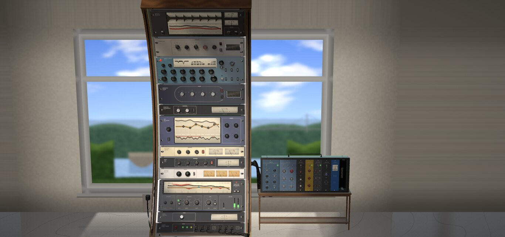

<p align="center">
  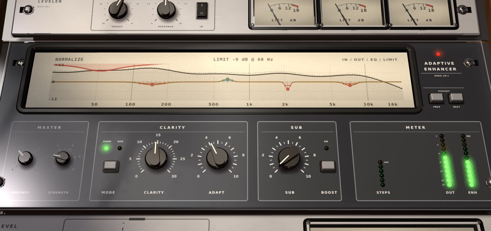
  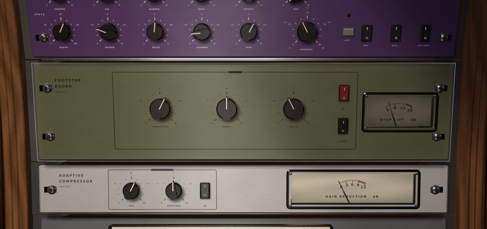
  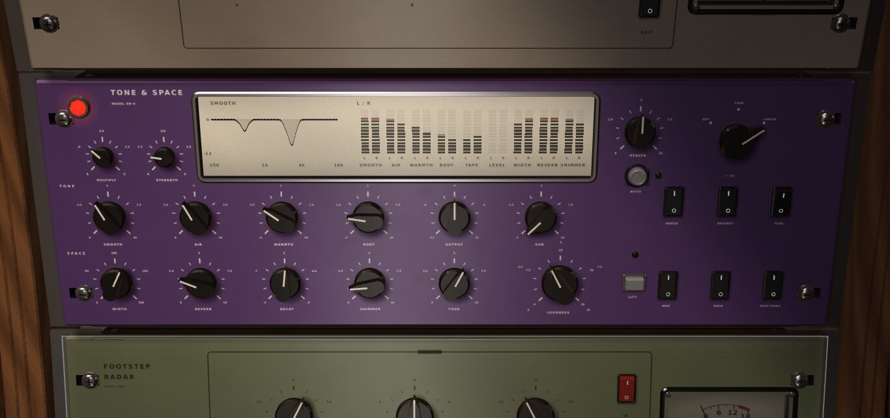
</p>

**Website:** [thenameiscobmarley.github.io/ENH-Master](https://thenameiscobmarley.github.io/ENH-Master/)

## New in 3.8.0.1: turn the rack round

Drag sideways on empty space (or right-click → **Turn the rack round**) and the rack turns on its shelf. Every unit
has a detailed back from one of ten makers, all of its cables plugged in, and a 96-point patch bay at the bottom
that really routes the sound. [Patch bay](Vault/UI/Patch%20bay.md)

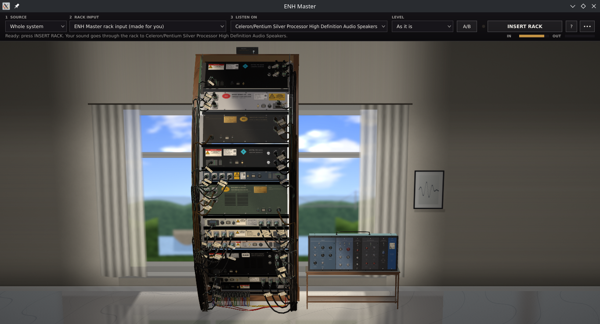

<p align="center">
  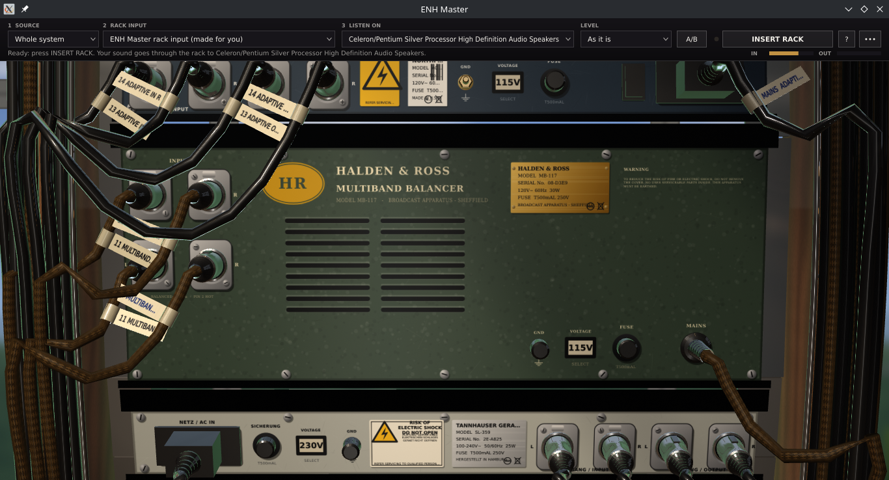
  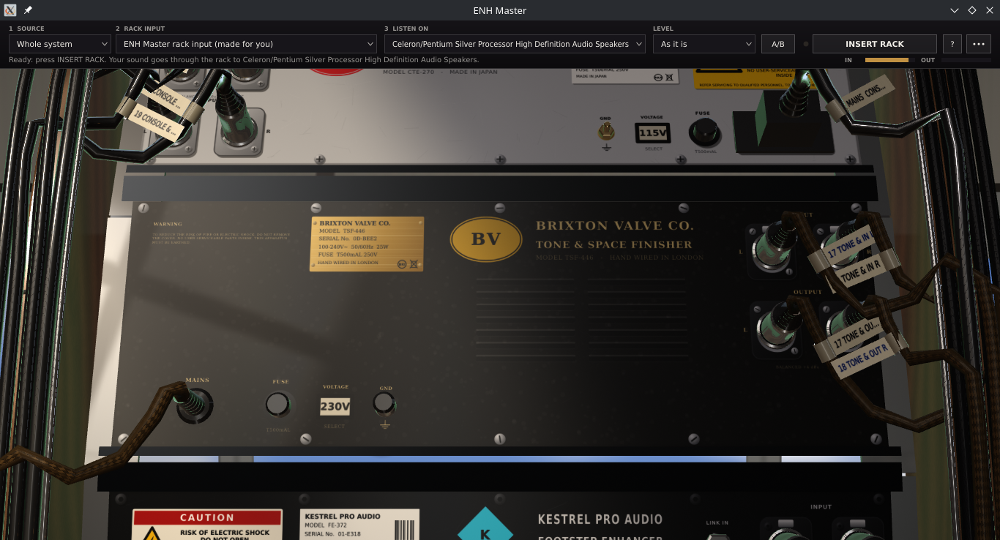
</p>
<p align="center">
  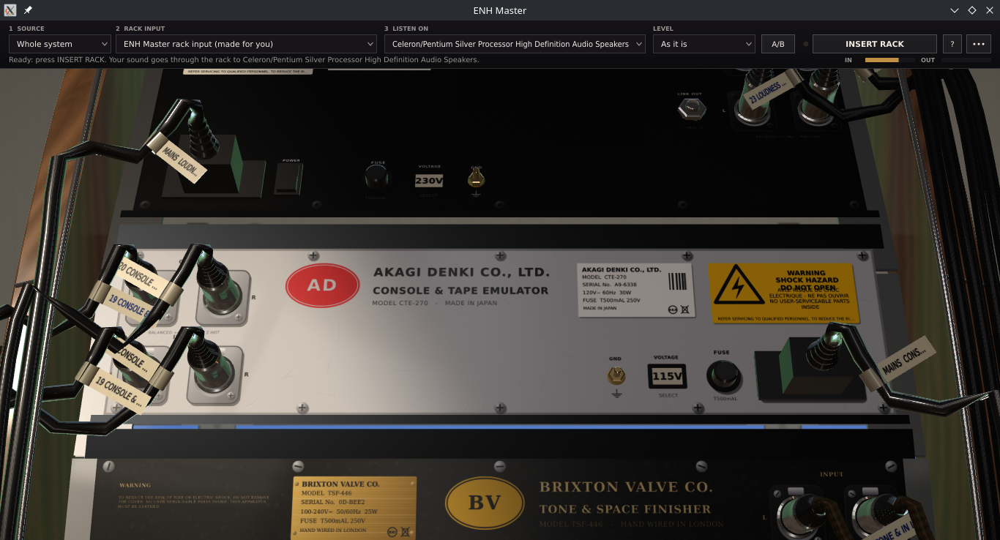
  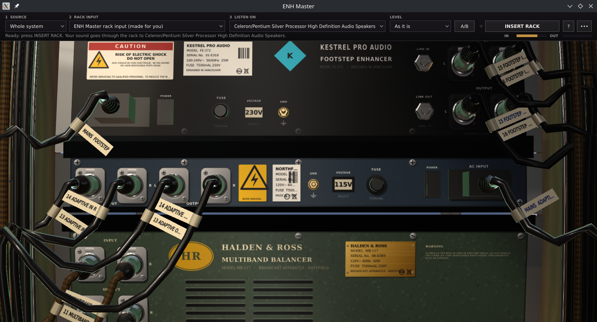
</p>

The patch bay: colour-coded TT cords along the real signal chain. Pull a plug, carry it, push it into another jack -
the sound follows the cords. The cables are real ropes: they hang, rest on the shelf and never pass through each other.

<p align="center">
  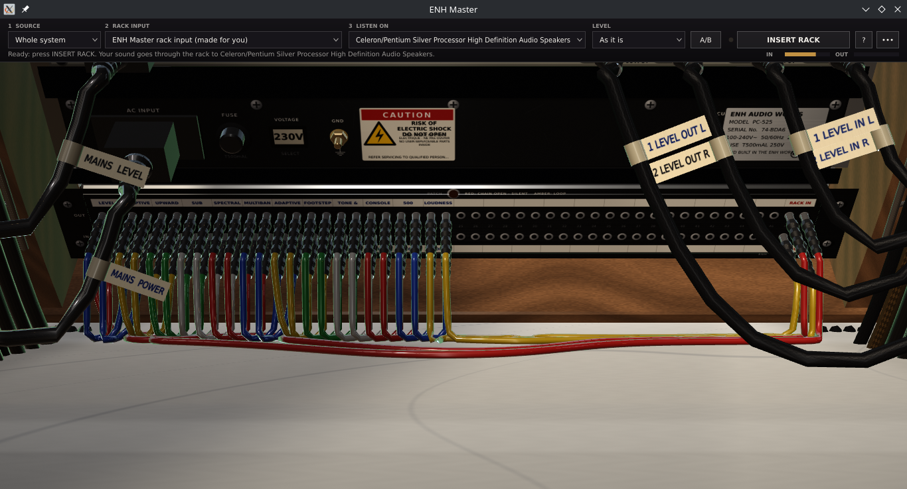
  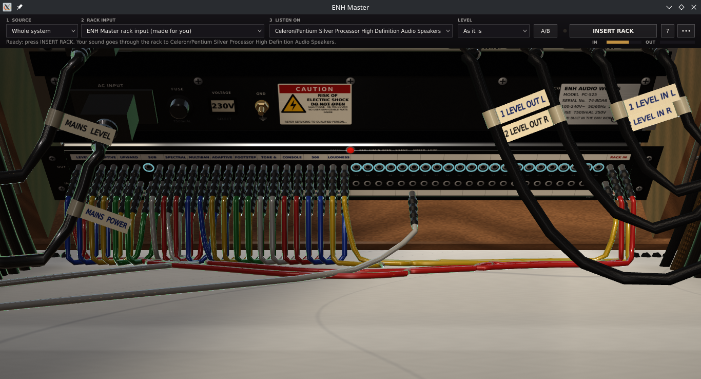
</p>
<p align="center">
  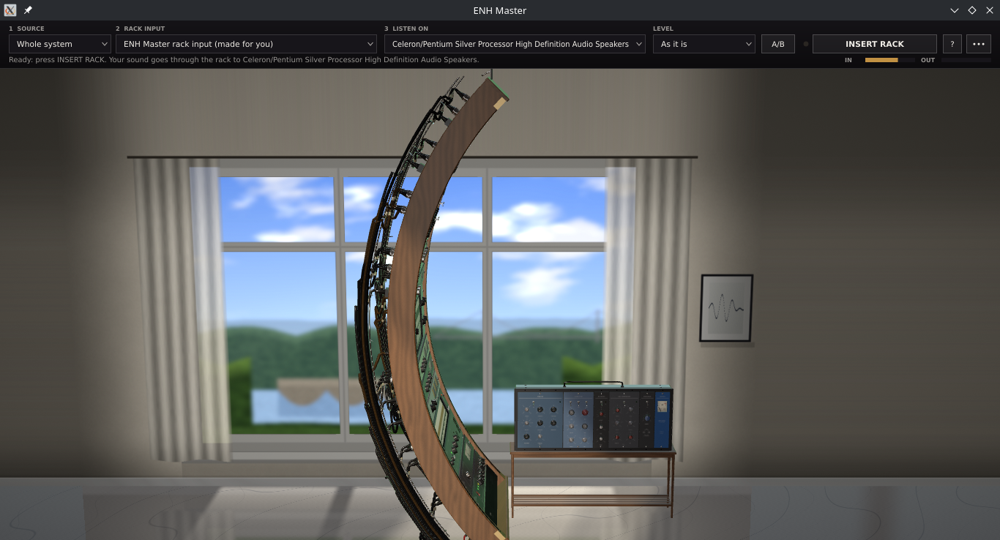
  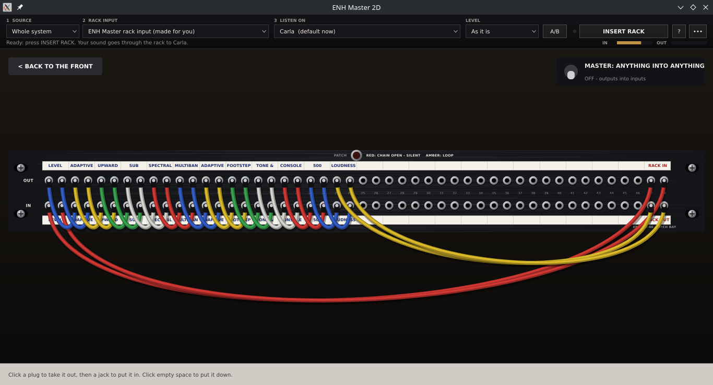
</p>

**SPECTRAL DETAIL ENHANCER**, a new unit: a simulation of hearing finds what the mix masks and brings it out, with
clarity, at the same level. Its screen shows the masking. Every unit now has a plain name that says what it is.

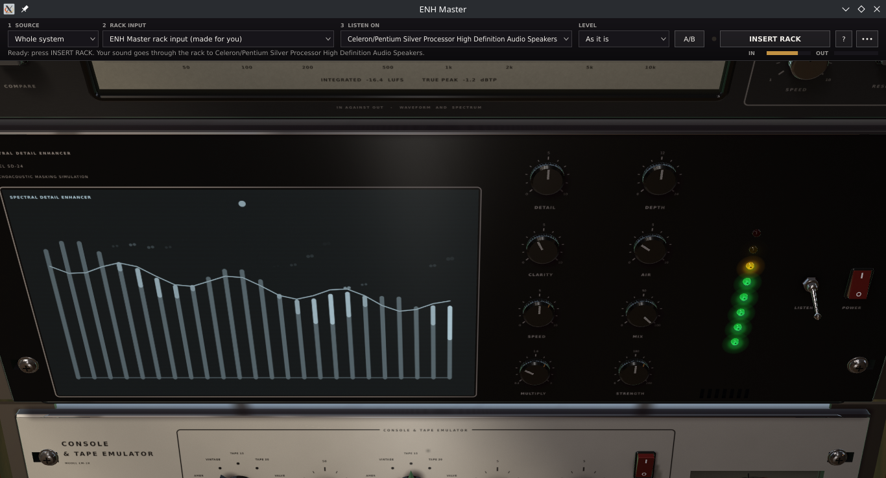

## Three ways to use it

| You are… | Use | Get it |
|---|---|---|
| a producer mastering in a DAW | the **VST3 plugin** | [latest release](https://github.com/thenameiscobmarley/ENH-Master/releases/latest) |
| a Carla user (Linux) | the **VST3 plugin** in Carla | same |
| a gamer | the **standalone app**: it puts the rack between your games and your headset, and takes it out again | the `windows-gamer-app` zip in the [latest release](https://github.com/thenameiscobmarley/ENH-Master/releases/latest) |

Windows and Linux. No macOS yet.

## Quick start

1. Download the zip for your system from [Releases](https://github.com/thenameiscobmarley/ENH-Master/releases).
2. **Plugin:** copy `ENH Master.vst3` into your VST3 folder (`C:\Program Files\Common Files\VST3` on
   Windows, `~/.vst3` on Linux) and rescan plugins in your DAW or Carla.
3. **Gamers:** install the free [VB-Audio Cable](https://vb-audio.com/Cable/), run `ENH Master.exe`, pick your
   headset under **LISTEN ON**, press **INSERT RACK**.
   More: [The router app](Vault/Tutorial/07%20The%20router%20app.md).
4. Pick a preset with **PRESET ◀ ▶** on the black unit. Start with **DEFAULT** or **COMPETITIVE FOOTSTEPS**.

New to it? Read the [tutorial](Vault/00%20Start%20Here.md), about 10 minutes.

## The rack

Sound goes in at the bottom and comes out at the top.

| Unit | What it does |
|---|---|
| **LEVEL CONTROL** | how loud the rack runs |
| **ADAPTIVE ENHANCER EQ** | brings out detail and sub, following the audio; CLARITY's precision bands fix narrow resonances and holes, each with its own width |
| **UPWARD COMPRESSOR** | lifts quiet sounds |
| **SUB-HARMONIC SYNTHESIZER** | adds a deep sub and a ringing "steel hull" under the bass |
| **SPECTRAL LIMITER** | takes a loud bang down *where it is*, so the rest of the mix doesn't duck |
| **MULTIBAND BALANCER** | keeps the bands of the mix in balance |
| **ADAPTIVE COMPRESSOR** | evens out the level |
| **FOOTSTEP ENHANCER** | finds footsteps in any game, near or far, lifts them, and shows on a radar where they came from |
| **TONE & SPACE FINISHER** | polish, air, width and room |
| **CONSOLE & TAPE EMULATOR** | the sound of consoles, tape and valves: two at once, blended |
| **LOUDNESS MONITOR** | shows what the rack does: before and after, loudness, and who is ducking |

Click any unit to open its **glass panel**: more settings, each explained when you hover it.

## Presets

DEFAULT · COMPETITIVE FOOTSTEPS · IMMERSIVE GAMES · NIGHT MODE · BASS HEAVY, PROTECTED ·
VOICE & STREAMING · MUSIC: WARM MASTER · MUSIC: WIDE & AIRY · DEEP SUB: SUBMARINE ·
MASTERING: ANALOG BUS · GAME: ARENA · TRANSPARENT (ALL OUT)

What each is for: [Presets](Vault/Reference/Presets.md). You can edit them in a text file without rebuilding.

## Safe for your ears and speakers

Always on, whatever you turn:

- **EAR GUARD:** the sound never suddenly gets more than 12 dB (about four times) louder than it has been.
  A blast after a quiet stretch is held down before you hear it; loud music that stays loud is untouched.
  (15 or 18 dB for more punch: OUTPUT MONITOR's glass panel.)
- Nothing leaves above 0 dBFS, including the peaks between samples.
- No DC or rumble below 8 Hz, a soft start with no pop, and silence instead of a blast if anything ever goes wrong.

[More](Vault/Reference/Safety.md). Your headset's volume is still yours to set: start low.

## Check your download

Every release has a `SHA256SUMS.txt` with the fingerprint of each download and of every script
(`build.sh`, `convert-to-windows.bat`, `scripts/`), and each zip has a `CHECKSUMS.txt` for the files in it.
On Windows: `Get-FileHash <file> -Algorithm SHA256` in PowerShell (or `certutil -hashfile <file> SHA256`);
on Linux: `sha256sum -c SHA256SUMS.txt --ignore-missing`. If a fingerprint differs, don't run the file.

## Versions

Four numbers: **MASSIVE.BIG.MEDIUM.SMALL**. When one goes up, the ones after it stay
(1.5.4.1 → 2.5.4.1). What changed in each: [CHANGELOG](CHANGELOG.md).

## Build it yourself

```sh
./build.sh          # checks your tools, fetches JUCE and HardwareKit, asks two questions, builds
```

Details, Windows builds and the tests: [Install and build](Vault/Tutorial/01%20Install%20and%20build.md).
Test everything in one go with `scripts/selftest.sh`.

## More

- [Docs](Vault/00%20Start%20Here.md) — the tutorial, every unit, and how it works
- [Searchbar](Searchbar.md) — find anything
- [HardwareKit](https://github.com/thenameiscobmarley/HardwareKit) — the 3D hardware library the look is built on
- License: [LICENSE](LICENSE)
