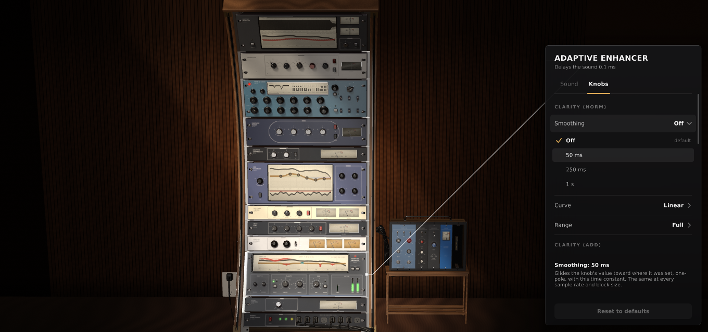

# Glass panel

> 🔎 **[Searchbar](../../Searchbar.md)** — find any doc, setting, function or GitHub page (Ctrl+F)

Click a unit and a dark smoked-glass panel opens on the right, joined to the unit by a thin white line.

## What's in it

Under the unit's name: how much it **delays the sound** (look-ahead or oversampling; most units add
none), and how many settings you've changed. The OUTPUT MONITOR shows the whole rack's delay.

Tabs across the top, one at a time:

- **Sound** — how the unit works. Each setting has two or more named choices.
- **Knobs** — for each knob: **Smoothing**, **Curve** and **Range** (and its own law, where it has one).
- **Stereo** — L/R, only the middle, or only the sides (on six units).
- **Output / Display** — on the OUTPUT MONITOR.
- **Design** — on CUSTOM: paste a design code, or empty the slot.

Each setting is one row: its name on the left, its value on the right. Click the row to see the choices
(a tick marks the one in use). A changed value is amber, and its tab gets an amber dot.

At the bottom: what the setting under the pointer does to the sound, and **Reset to defaults** (puts
the whole unit back). The full list: [Methods](../Reference/Methods.md).

## Good to know

- The first choice is always the original sound, so old sessions sound the same.
- Switching never clicks, and never changes the plugin's delay.
- Settings are saved with your session; presets leave them alone.

## Clicks

| Where | What happens |
|---|---|
| a unit's front | opens its panel (again = close, another = switch) |
| off the rack | closes it |
| a tab | shows that tab |
| the wheel over the panel | scrolls it |

## How it's drawn

Smoked frosted glass: the rack shows through it, blurred (at a quarter size, only while the panel is open)
and dimmed so the text always reads. A soft sheen falls across it from the top left, its top edge catches
the light, soft corners, a soft shadow, amber for what you changed.

Code: `GlassPanel.h/.cpp`, `MethodRegistry.h`.
